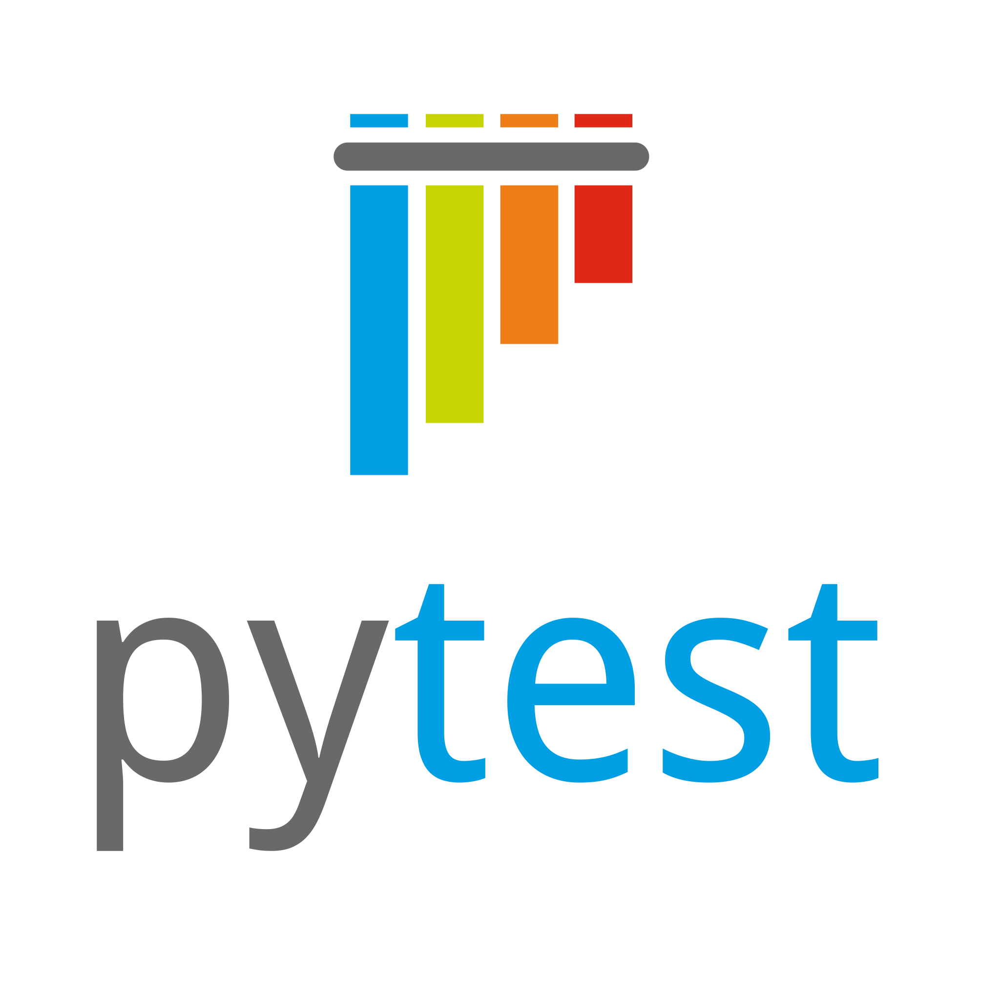

#### Teacher | Founder | Author | AI Learner & Engineer  | Technical Director | Embedded | Python Automation | Engineering Manager | Product Owner | C | TCP/IP Network Security Expert | Kernel Developer

- 🔭 I’m currently working as AI ML Engineer
- 🌱 Learning: AI reasearch
- 👯 Looking to collaborate on Healthcare Research
- 📫 How to reach me?: ...bhagavansprasad@gmail.com
- 😄 Pronouns: ...Bhagavan
- ⚡ Fun fact: ...I am a strict Teacher

## My Knowledged Hub

---

### AI 

- QueryMate with WhatsApp Group Message - [🔗](https://github.com/bhagavansprasad/QueryMate)
- ChromaDB Guide - [🔗](https://github.com/bhagavansprasad/chromadb-basics.git)

### Python

- Python: Debugging Utility - [🔗](https://github.com/bhagavansprasad/pdbwhereami)
- Python: WhatsApp Chat bot - [🔗](https://github.com/auratrainings/wapi)

### Technical writeups

- The Idea that caused my job: Debugging utility [🔗](https://dev.to/bhagavan_prasad_d1496a96a/python-debugging-utility-kd1)
- A Beginner's Practical Guide to Vector Database: ChromaDB [🔗](https://dev.to/bhagavan_prasad_d1496a96a/a-beginners-practical-guide-to-vector-database-chromadb-5122)

[LinkedIn](https://www.linkedin.com/in/bhagavan-prasad-8929991/)
---

          
    <b>⚡ Technologies I use </b>
      

    <table align="center">
        <tr>
            <td align="center" width="140" height="112.43">
                
                  Python
            </td>
            <td align="center" width="140" height="112.43">
                
                  Pandas
            </td>
            <td align="center" width="140" height="112.43">
                
                  NumPy
            </td>
            <td align="center" width="140" height="112.43">
                
                  
            </td>
            <td align="center" width="140" height="112.43">
                
                  DevOps
            </td>
            <td align="center" width="140" height="112.43">
                
                  Linux Kernel
            </td>
            <td align="center" width="140" height="112.43">
                
                  Pytorch
            </td>
            <td align="center" width="140" height="112.43">
                
                  FastAPI
            </td>
            <td align="center" width="140" height="112.43">
                
                  Docker
            </td>
        </tr>
    </table>
    

    
 **⚡ Technologies I use** 
      
    https://www.linkedin.com/in/bhagavan-prasad-8929991/

**⚡ Technologies I use**
       **⚡ Technologies I use**
      ---

  <b>My GitHub Stats</b> 
    
    
    

***Thanks for visiting my profile.***
